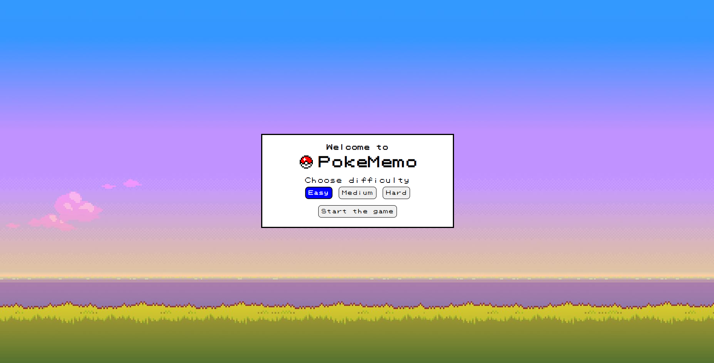
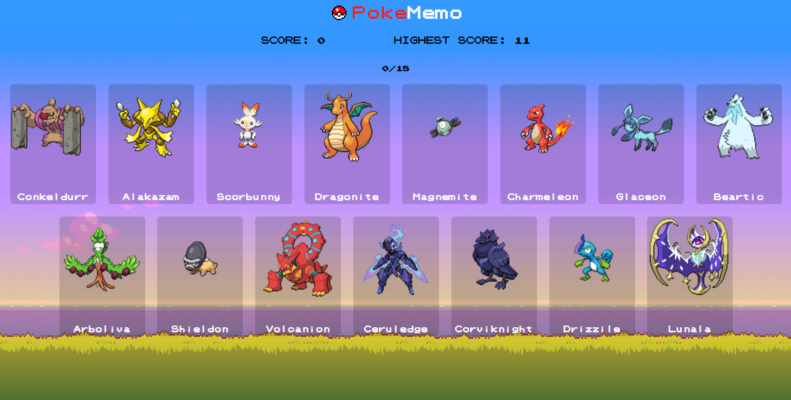

# PokéMemo (Deployed to `Vercel`)
## Deployment Address: [`pokememo-app-react.vercel.app`](https://pokememo-app-react.vercel.app "pokememo-app-react.vercel.app")
### A memory game themed around Pokémon. Users select a Pokémon card, which then shuffles randomly; the goal is to choose a different card each time. Implemented game logic to handle card selection and shuffling. Utilized local storage and data fetching through the fetch API.

## Table of Contents
- [Features](#features)
- [Demo](#demo)
- [Installation](#installation)
- [Usage](#usage)
- [Technologies Used](#technologies-used)
- [Contributing](#contributing)
- [License](#license)
- [Contact](#contact)

## Features
- Interactive memory game with Pokémon cards
- Card shuffling and selection logic
- Utilizes local storage for game state
- Fetches data using the fetch API
- Responsive design for various devices

## Demo
**Check out the live demo [here](https://pokememo-app-react.vercel.app).**




## Installation

1. Clone the repository:
    ```bash
    git clone https://github.com/myinan/pokememo-app-react.git
    ```

2. Navigate to the project directory:
    ```bash
    cd pokememo-app-react
    ```

3. Install dependencies:
    ```bash
    npm install
    ```

4. Start the development server:
    ```bash
    npm start
    ```

5. Open your browser and go to `http://localhost:3000`

## Usage
- **Start Game:** Start the game by choosing a difficulty.
- **Select Cards:** Continue selecting different Pokémon cards, avoiding repeats.
- **Win Condition:** The game shuffles cards after each selection, aiming to never pick the same card twice.

## Technologies Used
- React
- Fetch API
- Local Storage
- Vercel

## Contributing
Contributions are welcome! Please feel free to submit a Pull Request.

## License
This project is licensed under the MIT License.

## Contact
Created by [Yasir İnan](https://github.com/myinan) - feel free to contact me!
